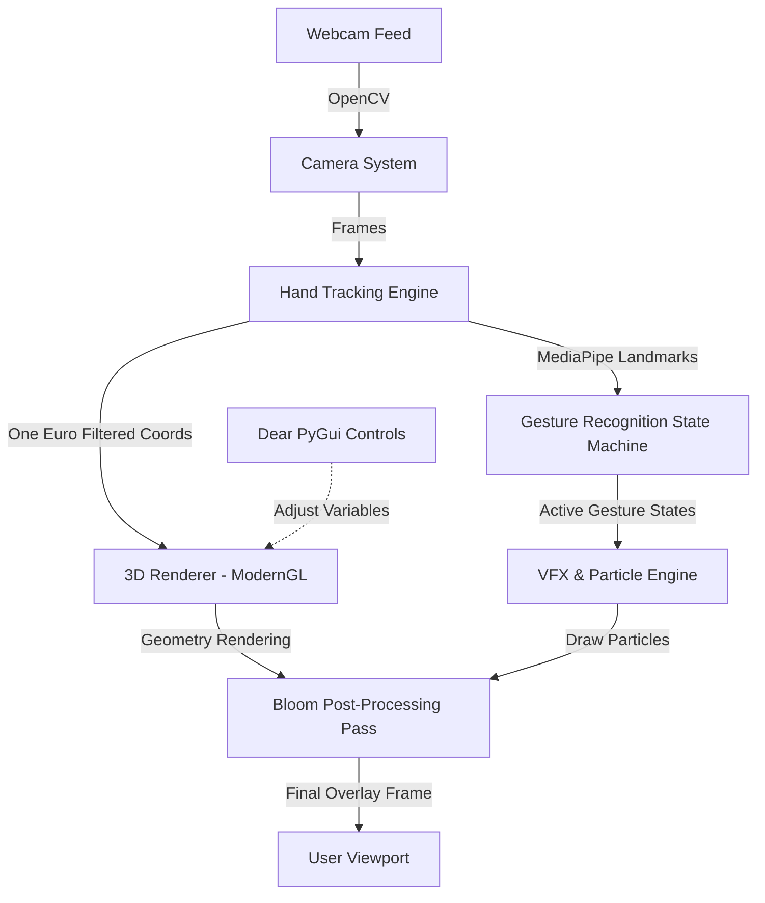

# Hand Tracking 3D VFX System

A professional, real-time, interactive hand-tracking system that overlays premium 3D models (orchid flowers, fantasy wings, butterflies) on a user's hand, integrated with a particle engine and high-quality post-processing glow (Bloom) and lighting effects.

This project is built incrementally, module by module, to ensure production-level code quality, complete testing, and architectural modularity.

---

## 🛠️ Technology Stack

*   **Logic & Runtime:** Python 3.10+
*   **Video Processing:** OpenCV (`opencv-python`)
*   **AI Hand Tracking:** MediaPipe Hands (21 Landmarks with Depth Estimation)
*   **Rendering:** ModernGL (OpenGL 3.3+ Core Profile)
*   **Mathematics:** PyGLM (OpenGL Mathematics) and NumPy
*   **User Interface:** Dear PyGui (GPU-accelerated desktop UI)
*   **Configuration:** YAML

---

## 📁 Directory Structure

```text
3dmodel/
├── config/                 # YAML Configuration settings
│   └── settings.yaml       # Resolution, tracking thresholds, VFX lists
├── src/                    # Source code modules
│   ├── camera/             # Video capturing and optimization
│   ├── tracking/           # Hand detection, filters, gesture state machine
│   ├── renderer/           # ModernGL engine, FBOs, post-processing, shaders
│   ├── assets/             # 3D assets loaders and storage
│   ├── particles/          # GPU particle simulation and emitters
│   ├── effects/            # High-level VFX configurations
│   └── ui/                 # Dear PyGui panels and debug overlay
├── tests/                  # Automated verification tests
├── requirements.txt        # Python package dependencies
├── run.py                  # Setup, verification, and launch runner
└── README.md               # Documentation and guides
```

---

## 🚀 Installation & Setup

### 1. Prerequisites
Make sure Python 3.10+ is installed on your Windows machine. Verify by running:
```powershell
python --version
```

### 2. Install Dependencies
Install all package dependencies via `pip`:
```powershell
pip install -r requirements.txt
```

### 3. Setup Project Folders
Run the setup mode on the launcher script to build the folder structure and verify dependencies:
```powershell
python run.py --setup
```

### 4. Run the System
Boot the workspace (currently boots Module 1 stub, waiting for Module 2):
```powershell
python run.py --run
```

---

## 🔧 Architectural Flow



---

## 🧪 Testing

Automated tests are located in the `tests/` directory. Run tests using pytest or python:
```powershell
python -m unittest discover -s tests
```
